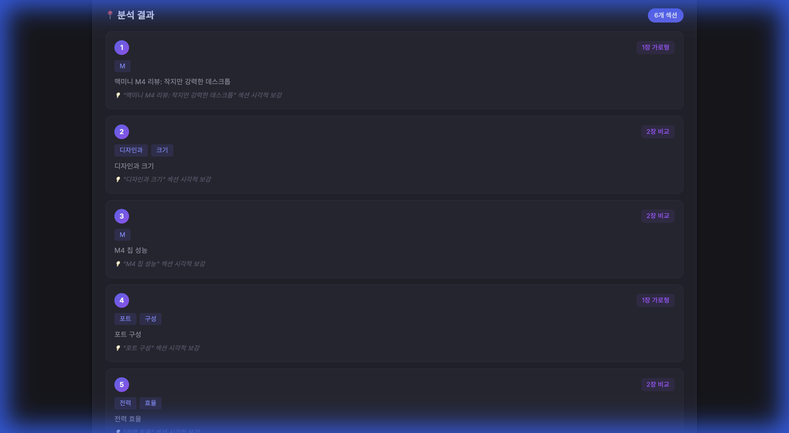
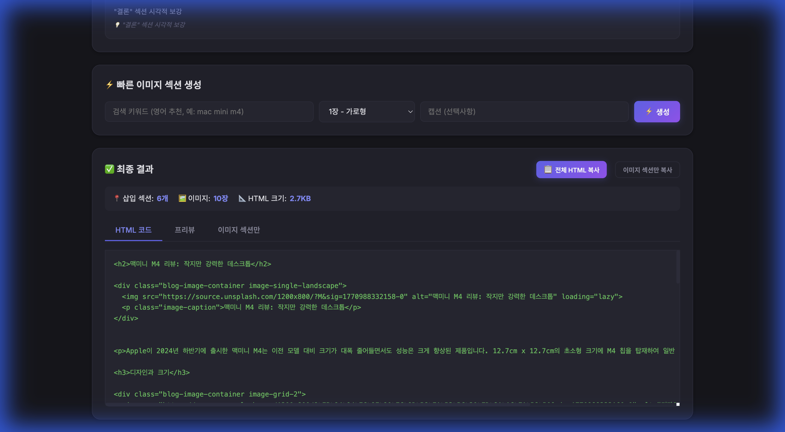
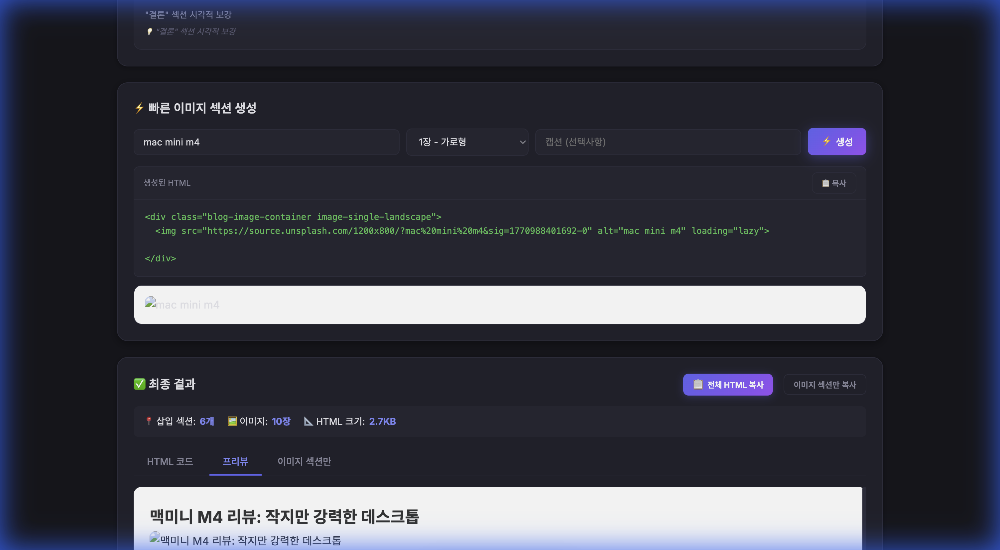

# 🖼️ 블로그 이미지 자동 삽입 도구

블로그 글(HTML)을 붙여넣으면 **AI가 자동으로 분석 → 이미지 검색 → 반응형 HTML 생성**하는 로컬 웹 도구입니다.

## 프로젝트 구조

| 파일 | 역할 |
|------|------|
| `server.js` | Express API 서버 (4개 엔드포인트) |
| `lib/analyzer.js` | GPT-4o-mini 글 분석 + 규칙 기반 fallback |
| `lib/image-search.js` | Unsplash API/Source 이미지 검색 |
| `lib/optimizer.js` | Sharp 리사이즈 + WebP 변환 |
| `lib/html-builder.js` | reference CSS 기반 HTML 빌더 |
| `public/` | 다크 모드 UI (HTML + CSS + JS) |

---

## 스크린샷

### 1. 글 분석 → 6개 삽입점 자동 발견



### 2. 전체 파이프라인 → HTML 코드 자동 생성



### 3. 빠른 섹션 생성기 + 프리뷰



---

## 사용법

### 설치

```bash
npm install
```

### 환경 변수 설정 (선택)

`.env.example`을 `.env`로 복사 후 API 키를 설정합니다:

```bash
cp .env.example .env
```

| 설정 | 효과 | 비용 |
|------|------|------|
| `OPENAI_API_KEY` | AI 기반 정확한 분석 (없으면 규칙 기반 fallback) | ~$0.001/요청 |
| `UNSPLASH_ACCESS_KEY` | 정확한 이미지 검색 (없으면 Source URL fallback) | 무료 |

### 실행

```bash
node server.js
# → http://localhost:3000 접속
```

### 워크플로우

1. **글 붙여넣기**: Claude가 생성한 HTML 블로그 글을 입력
2. **분석하기**: AI가 섹션별로 이미지 삽입 위치 + 키워드 + 레이아웃 자동 판단
3. **전체 처리**: 이미지 검색 + HTML 생성 한번에 실행
4. **HTML 복사**: "전체 HTML 복사" 또는 "이미지 섹션만 복사"
5. **붙여넣기**: 티스토리 에디터 HTML 모드에서 Ctrl+V

### 빠른 이미지 섹션 생성

글 전체가 아닌 **개별 이미지 섹션만** 빠르게 만들고 싶을 때:

1. 키워드 입력 (예: `mac mini m4`)
2. 레이아웃 선택 (1장 가로형 / 2장 비교 / 3장 / 4장 / Before-After)
3. ⚡ 생성 → 📋 복사 → 티스토리에 붙여넣기

---

## 지원 레이아웃

CSS 클래스는 `reference/image-layout-classes.css`에 정의되어 있으며, 티스토리 skin.css에 추가해야 합니다.

| 클래스 | 설명 | 이미지 수 |
|--------|------|-----------|
| `image-single-landscape` | 1장 가로형 | 1장 |
| `image-single-portrait` | 1장 세로형 | 1장 |
| `image-grid-2` | 좌우 2장 배치 | 2장 |
| `image-grid-3` | 1+2 레이아웃 | 3장 |
| `image-grid-4` | 2x2 그리드 | 4장 |
| `image-compare` | Before/After 비교 | 2장 |

---

## 기술 스택

- **Backend**: Node.js, Express
- **Frontend**: Vanilla HTML/CSS/JS
- **이미지 검색**: Unsplash API
- **글 분석**: OpenAI GPT-4o-mini (선택)
- **이미지 최적화**: Sharp (WebP 변환)
